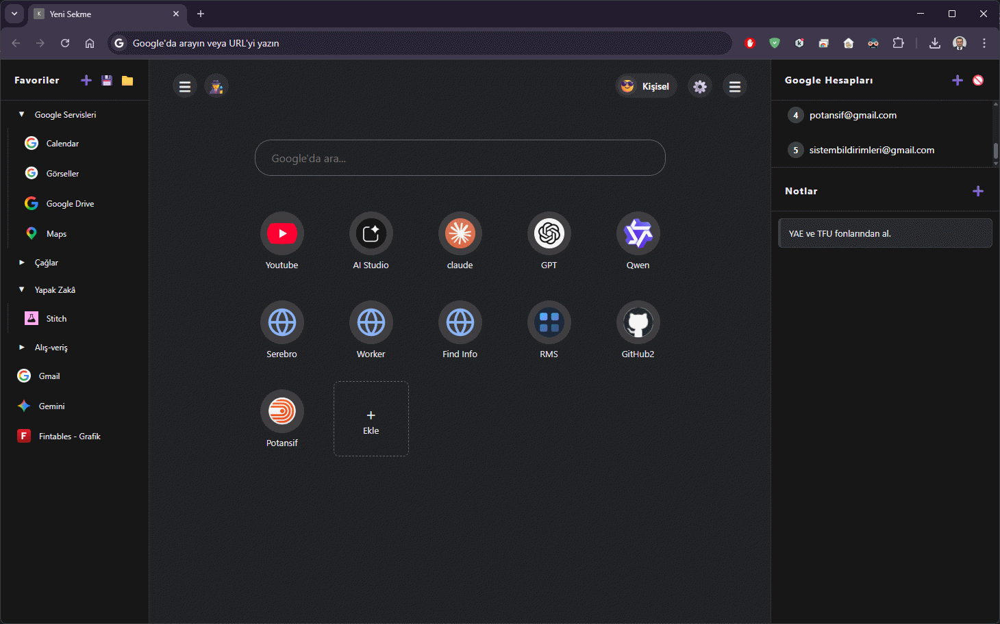

# Kokpit - Personal New Tab Control Center / Kişisel Yeni Sekme Kontrol Merkezi

[English](#english) | [Türkçe](#türkçe)

## 🇬🇧 English

**Kokpit** is a powerful, customizable, and modern "New Tab" extension for Chrome. It turns your browser's start page into a high-efficiency command center designed for power users who manage multiple projects and Google accounts.

*(Mockup representation of the UI)*

### ✨ Key Features

*   **🚀 Customizable Shortcut Grid:** Add, edit, and organize your most-used sites in a clean, visual grid.
*   **📂 Hierarchical Sidebar:** Manage a deep tree of favorites and folders (up to 3 levels) for quick access.
*   **👥 Multi-Profile Management:** Create different profiles (e.g., Work, Personal, Side Project) with unique sets of shortcuts.
*   **🔑 Google AuthUser Support:** Seamlessly switch between different Google accounts (authuser=0, 1, 2...) directly from the sidebar.
*   **📝 Integrated Notes:** Quick note-taking area with color-coded categories (Critical, Info, Safe, Warning).
*   **🛠️ Flexible Layout:** Draggable resizers (splitters) to customize the width of your sidebars.
*   **💾 Import/Export:** Securely backup or transfer your entire configuration as a JSON file.
*   **🕵️ Quick Utilities:** One-click "New Incognito Tab" and profile switching.

### 🚀 Installation

1.  **Download** or Clone this repository.
2.  Open Chrome and navigate to `chrome://extensions/`.
3.  Enable **Developer Mode** (top right corner).
4.  Click **Load unpacked**.
5.  Select the folder containing the project files.

### 🛠️ Tech Stack

- **Structure:** HTML5 (Semantic)
- **Styling:** Vanilla CSS3 (Custom variables, Flexbox/Grid, Glassmorphism)
- **Logic:** JavaScript (ES6+, LocalStorage for persistence)
- **API:** Chrome Extensions Manifest V3

---

## 🇹🇷 Türkçe

**Kokpit**, Chrome için geliştirilmiş güçlü, kişiselleştirilebilir ve modern bir "Yeni Sekme" eklentisidir. Tarayıcınızın başlangıç sayfasını, özellikle çoklu proje ve hesap yöneten kullanıcılar için tasarlanmış yüksek verimlilikli bir komuta merkezine dönüştürür.

### ✨ Öne Çıkan Özellikler

*   **🚀 Özelleştirilebilir Kısayol Izgarası:** En çok kullandığınız siteleri temiz ve görsel bir ızgarada düzenleyin.
*   **📂 Hiyerarşik Yan Menü:** 3 seviyeye kadar derinleşebilen klasör yapısıyla favorilerinizi organize edin.
*   **👥 Çoklu Profil Yönetimi:** Farklı bağlamlar (İş, Kişisel, Yan Proje) için ayrı kısayol setleri oluşturun.
*   **🔑 Google AuthUser Desteği:** Yan menüden Google hesaplarınız (authuser=0, 1, 2...) arasında hızlıca geçiş yapın.
*   **📝 Entegre Notlar:** Renk kodlu kategorilere (Kritik, Bilgi, Güvenli, Dikkat) sahip hızlı not alma alanı.
*   **🛠️ Esnek Yerleşim:** Yan menü genişliklerini sürükle-bırak (resizer) ile kendinize göre ayarlayın.
*   **💾 İçe/Dışa Aktar:** Tüm yapılandırmanızı JSON dosyası olarak yedekleyin veya başka cihazlara taşıyın.
*   **🕵️ Hızlı Araçlar:** Tek tıkla "Yeni Gizli Sekme" açma ve profil değiştirme.

### 🚀 Kurulum

1.  Bu depoyu **indirin** veya klonlayın.
2.  Chrome'u açın ve `chrome://extensions/` adresine gidin.
3.  **Geliştirici Modu**'nu (sağ üst köşe) aktif hale getirin.
4.  **Paketlenmemiş öğe yükle** butonuna tıklayın.
5.  Proje dosyalarının bulunduğu klasörü seçin.

### 🛠️ Teknolojiler

- **Yapı:** HTML5 (Semantik)
- **Stil:** Vanilla CSS3 (Custom variables, Flexbox/Grid, Glassmorphism)
- **Mantık:** JavaScript (ES6+, LocalStorage kalıcılığı)
- **API:** Chrome Extensions Manifest V3
